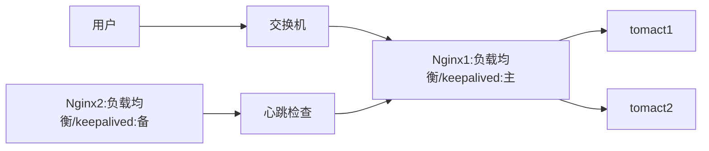

> 之前因为公司的产品需求，研究过分布式方案，最近抽空整理了下

# 解决方案

- 主要是以`nginx`搭载`keepalived`实现 web 业务服务器 `keepalives`防止单点故障
- `reids`分布式缓存
- `fastdfs`分布式文件
- `postgre-xl`分布式数据库服务器

> 简单说，分布式是以缩短单个任务的执行时间来提升效率的，而集群则是通过提高单位时间内执行的任务数来提升效率。

[参考](https://segmentfault.com/a/1190000002418709)

<!--  more  -->

> 以下是实验中遇到的问题以及安装方法

# CentOS7 安装问题集

> 远程无法访问（防火墙问题）

```bash
firewall-cmd --zone=public --add-port=80/tcp --permanent

firewall-cmd --reload

systemctl stop firewalld.service #停止

systemctl disable firewalld.service #禁用

firewall-cmd --state #查看默认防火墙状态（关闭后显示notrunning，开启后显示running）

# liunx图形界面获得root权限
直接 `sudo nautilus` （unity，gnome）或 `sudo dolphin` (kde) ,就可以以root权限打开文件管理器了

# liunx 远程获取root权限
`sudo vi /etc/ssh/sshd_config`
将PermitRootLogin值改yes
允许不输入密码登录
将PermitEmptyPasswords yes前面的#号去掉
重启服务：service sshd restart（/etc/initd.d/sshd restart）
```

# nginx

参考另一篇[nginx 安装](https://rsl140.github.io/blog/2018/01/06/nginx/)

# keepalives

## 简介

Keepalived 是一个基于 VRRP 协议来实现的服务高可用方案，可以利用其来避免 IP 单点故障，类似的工具还有 heartbeat、corosync、pacemaker。

但是它一般不会单独出现，而是与其它负载均衡技术（如 lvs、haproxy、nginx）一起工作来达到集群的高可用。

Keepalived 的作用是检测服务器的状态，如果有一台 web 服务器死机，或工作出现故障，Keepalived 将检测到，并将有故障的服务器从系统中剔除，同时使用其他服务器代替该服务器的工作；

当服务器工作正常后 Keepalived 自动将服务器加入到服务器群中，这些工作全部自动完成，不需要人工干涉，需要人工做的只是修复故障的服务器。

## 原理



首先 Keepalived 可以在主机上产生一个虚拟的 ip, 这里叫做 vip(v 是 virtual 的意思):192.168.200.150, keepalived 会将这个 vip 绑定到交换机上.

当用户访问主机:192.168.200.129 时, 交换机会通过这个 ip 和 vip 的对应找到 192.168.200.129 上的 Nginx 进行处理.

如果当有一天 192.168.200.129 上的 Nginx 挂掉的时候, Keepalived 会立即在备机上生成一个相同的 vip: 192.168.200.150, 当用户继续访问 192.168.200.129 时, 交换机上已经绑定了 vip, 这时发现这个 vip 是存在于 192.168.200.130 上面的, 所以直接将请求转发到了备机上.

如果主机被修复好能够继续对外提供服务时, 这时 keepalived 会将主机上继续生成这个 vip, 同时回收在备机上生成的 vip. 这个是通过心跳检查来判断主机已恢复使用.

## 安装

### 下载

wget http://www.keepalived.org/software/keepalived-1.2.23.tar.gz

### 解压

tar -zxvf keepalived-1.2.23.tar.gz
cd keepalived-1.2.23

### 安装

./configure --prefix=/usr/local/keepalived #prefix 指定安装目录

如果提示错误 openssl 不存在
sudo apt-get install openssl
sudo apt-get install libssl-dev

make
make install

### 配置

``` bash
【/usr/local/keepalived/etc/keepalived/keepalived.conf】
   global_defs {
       notification_email { #指定keepalived在发生事情的时候，发送邮件告知，可以有多个地址，每行一个。
           acassen@firewall.loc
           failover@firewall.loc
           sysadmin@firewall.loc
       }
       notification_email_from Alexandre.Cassen@firewall.loc #指定发件人
       smtp_server 127.0.0.1 #发送email的smtp地址
       smtp_connect_timeout 30 #超时时间
       router_id nginx #运行keepalived的机器的一个标识,多个节点标识可以相同，也可以不同
       vrrp_skip_check_adv_addr
       vrrp_strict
       vrrp_garp_interval 0
       vrrp_gna_interval 0
   }

   vrrp_instance VI_1 {
       state MASTER #指定当前节点为主节点 备用节点上设置为BACKUP即可
       interface eth0 #绑定虚拟IP的网络接口,使用ip a 查看网卡名称2.网卡名称
       virtual_router_id 51 #VRRP组名，两个节点的设置必须一样，以指明各个节点属于同一VRRP组
       priority 100 #主节点的优先级（1-254之间），备用节点必须比主节点优先级低
       advert_int 1
       authentication { #设置验证信息，两个节点必须一致
       　　auth_type PASS
       　　auth_pass 1111
       }
       virtual_ipaddress { #指定虚拟IP, 两个节点设置必须一样
       　　192.168.0.110/24
       }
   }

   【/usr/local/keepalived/etc/sysconfig/keepalived】

   KEEPALIVED_OPTIONS="-D -f /usr/local/keepalived/etc/keepalived/keepalived.conf" #指定keepalived配置文件路径


因为我们使用非默认路径（/usr/local）安装keepalived，需要设置一些软链接以保证keepalived能正常启动

ln -s /usr/local/keepalived/sbin/keepalived  /usr/bin #将keepalived主程序加入到环境变量
ln -s /usr/local/keepalived/etc/sysconfig/keepalived  /etc/sysconfig/ #keepalived启动脚本变量引用文件，默认文件路径是/etc/sysconfig/，也可以不做软链接，直接修改启动脚本中文件路径即可
cp /usr/local/src/keepalived-1.4.0/keepalived/etc/init.d/keepalived /etc/init.d/
cp -r ./keepalived/etc/keepalived  /etc/  #注意更新
```


### 启动
``` bash
   service keepalived start|stop|restart
   systemctl daemon-reload
   chkconfig keepalived on
```
默认的配置文件中，指定了虚拟可使用ip addr（或ip a）命令验证之。查看网卡下是否有虚拟ip
如果虚拟ip ping不同
1.vim /etc/keepalived/keepalived.conf
把这个注释就可以了
vrrp_strict

2.可能上级交换机或路由器绑定了apr，也就是ip与mac地址绑定
可以使用 arping -I [网卡名] -c 5 -s [本机IP或vip] [网关] 看一下接收情况


应用

keepalived两种模式：主-备、主-主

主-备

`虚拟IP：192.168.0.110         主节点：192.168.0.50          备用节点：192.168.0.51`

### 主配置文件

   【/usr/local/keepalived/etc/keepalived/keepalived.conf】

   global_defs {
       notification_email { #指定keepalived在发生事情的时候，发送邮件告知，可以有多个地址，每行一个。
           acassen@firewall.loc
           failover@firewall.loc
           sysadmin@firewall.loc
       }
       notification_email_from Alexandre.Cassen@firewall.loc #指定发件人
       smtp_server 127.0.0.1 #发送email的smtp地址
       smtp_connect_timeout 30 #超时时间
       router_id LVS_DEVEL #运行keepalived的机器的一个标识,多个节点标识可以相同，也可以不同
       vrrp_skip_check_adv_addr
       vrrp_strict
       vrrp_garp_interval 0
       vrrp_gna_interval 0
   }

   vrrp_instance VI_1 {
       state MASTER #指定当前节点为主节点 备用节点上设置为BACKUP即可
       interface eth0 #绑定虚拟IP的网络接口 使用ip a查看
       virtual_router_id 51 #VRRP组名，两个节点的设置必须一样，以指明各个节点属于同一VRRP组
       priority 100 #主节点的优先级（1-254之间），备用节点必须比主节点优先级低
       advert_int 1
       authentication { #设置验证信息，两个节点必须一致
           auth_type PASS
           auth_pass 1111
       }
       virtual_ipaddress { #指定虚拟IP, 两个节点设置必须一样
           192.168.0.110/24
       }
   }


### 备配置文件
   【/usr/local/keepalived/etc/keepalived/keepalived.conf】

   global_defs {
       notification_email { #指定keepalived在发生事情的时候，发送邮件告知，可以有多个地址，每行一个。
           acassen@firewall.loc
           failover@firewall.loc
           sysadmin@firewall.loc
       }
       notification_email_from Alexandre.Cassen@firewall.loc #指定发件人
       smtp_server 127.0.0.1 #发送email的smtp地址
       smtp_connect_timeout 30 #超时时间
       router_id LVS_DEVEL #运行keepalived的机器的一个标识,多个节点标识可以相同，也可以不同
       vrrp_skip_check_adv_addr
       vrrp_strict
       vrrp_garp_interval 0
       vrrp_gna_interval 0
   }

   vrrp_instance VI_1 {
       state BACKUP #指定当前节点为主节点 备用节点上设置为BACKUP即可
       interface eth0 #绑定虚拟IP的网络接口
       virtual_router_id 51 #VRRP组名，两个节点的设置必须一样，以指明各个节点属于同一VRRP组
       priority 99 #主节点的优先级（1-254之间），备用节点必须比主节点优先级低
       advert_int 1
       authentication { #设置验证信息，两个节点必须一致
           auth_type PASS
           auth_pass 1111
       }
       virtual_ipaddress { #指定虚拟IP, 两个节点设置必须一样
           192.168.0.110/24
       }
   }


主-主

虚拟IP：192.168.1.21、192.168.1.22      A节点：192.168.1.23       B节点：192.168.1.24

主备模式的缺点就是始终只有一台机器位于工作状态，另外一台机器永远是备用状态，存在资源浪费之问题。

双主模式允许两台机器均处于工作状态并互相作为备份。搭建keepalived双方模式的要素：

1.必须有两个虚拟IP, 分别绑定至两个节点上

2.每个节点作为某个虚拟IP的主节点，并同时作为另外一个虚拟IP的备用节点。

3.当某个节点产生故障时，两个虚拟IP自动绑定至正常节点上

也就是说，两个节点的配置应该是交叉的，对同个虚拟IP，交叉互为主备。


### 节点A配置文件

   【/usr/local/keepalived/etc/keepalived/keepalived.conf】

   global_defs {
       notification_email { #指定keepalived在发生事情的时候，发送邮件告知，可以有多个地址，每行一个。
           acassen@firewall.loc
           failover@firewall.loc
           sysadmin@firewall.loc
       }
       notification_email_from Alexandre.Cassen@firewall.loc #指定发件人
       smtp_server 127.0.0.1 #发送email的smtp地址
       smtp_connect_timeout 30 #超时时间
       router_id LVS_DEVEL #运行keepalived的机器的一个标识,多个节点标识可以相同，也可以不同
       vrrp_skip_check_adv_addr
       vrrp_strict
       vrrp_garp_interval 0
       vrrp_gna_interval 0
   }

   vrrp_instance VI_1 {
       state MASTER
       interface eth0
       virtual_router_id 51 #本机两个vrrp_instance组的此值不能相同，但对应备用节点的此值必须相同
       priority 100 #对应备用节点值应该比此值小
       advert_int 1
       authentication {
           auth_type PASS
           auth_pass 1111
       }
       virtual_ipaddress {
           192.168.1.21/24
       }
   }

   vrrp_instance VI_2 {
       state BACKUP
       interface eth0
       virtual_router_id 52 #本机两个vrrp_instance组的此值不能相同，但对应备用节点的此值必须相同
       priority 99 #主节点的值应该比此值大
       advert_int 1
       authentication {
           auth_type PASS
           auth_pass 1111
       }
       virtual_ipaddress {
           192.168.1.22/24
       }
   }


### 节点B配置文件
   【/usr/local/keepalived/etc/keepalived/keepalived.conf】

   global_defs {
   　　　notification_email { #指定keepalived在发生事情的时候，发送邮件告知，可以有多个地址，每行一个。
   　　　　acassen@firewall.loc
   　　　　failover@firewall.loc
   　　　　sysadmin@firewall.loc
   }
   　　notification_email_from Alexandre.Cassen@firewall.loc #指定发件人
   　　smtp_server 127.0.0.1 #发送email的smtp地址
   　　smtp_connect_timeout 30 #超时时间
   　　router_id LVS_DEVEL #运行keepalived的机器的一个标识,多个节点标识可以相同，也可以不同
   　　vrrp_skip_check_adv_addr
   　　vrrp_strict
   　　vrrp_garp_interval 0
   　　vrrp_gna_interval 0
   }

   vrrp_instance VI_1 {
   　　state BACKUP
   　　interface eth0
   　　virtual_router_id 51 #本机两个vrrp_instance组的此值不能相同，但对应备用节点的此值必须相同
   　　priority 99 #对应主节点值应该比此值大
   　　advert_int 1
   　　authentication {
   　　　　auth_type PASS
   　　　　auth_pass 1111
   　　}
   　　virtual_ipaddress {
   　　　　192.168.1.21/24
   　　}
   }

   vrrp_instance VI_2 {
   　　state MASTER
   　　interface eth0
   　　virtual_router_id 52 #本机两个vrrp_instance组的此值不能相同，但对应备用节点的此值必须相同
   　　priority 100 #对应备用节点的值应该比此值小
   　　advert_int 1
   　　authentication {
   　　　　auth_type PASS
   　　　　auth_pass 1111
   　　}
   　　virtual_ipaddress {
   　　　　192.168.1.22/24
   　　}
   }


## 问题

两个节点实际都处于正常工作状态，但是无法接收到彼此的组播通知，这时两个节点均强行绑定虚拟IP，导致不可预料的后果。

这时就需要设置仲裁，即每个节点必须判断自身的状态（应用服务状态及自身网络状态），要实现这两点可使用自定义shell脚本实现，通过周期性地检查自身应用服务状态，并不断ping网关（或其它可靠的参考IP）均可。当自身服务异常、或无法ping通网关，则认为自身出现故障，就应该移除掉虚拟IP(停止keepalived服务即可）。


主要借助keepalived提供的vrrp_script及track_script实现：

在keepalived的配置文件最前面加入以下代码，定义一个跟踪脚本：

vrrp_script check_local { #定义一个名称为check_local的检查脚本
　　script "/usr/local/keepalived/bin/check_local.sh" #shell脚本的路径
　　interval 5 #运行间隔
}

再在vrrp_instance配置中加入以下代码使用上面定义的检测脚本：

track_script {
　　check_local
}
我们在/usr/local/keepalived/bin/check_local.sh定义的检测规则是：

1. 自身web服务故障（超时，http返回状态不是200）

2. 无法ping通网关

3. 产生以上任何一个问题，均应该移除本机的虚拟IP(停止keepalived实例即可)


但这里有个小问题，如果本机或是网关偶尔出现一次故障，那么我们不能认为是服务故障。更好的做法是如果连续N次检测本机服务不正常或连接N次无法ping通网关，才认为是故障产生，才需要进行故障转移。

但这么做的缺点是，如果脚本检测到故障产生，并停止掉了keepalived服务，那么当故障恢复后，keepalived是无法自动恢复的。


还可以利用独立的脚本以秒级的间隔检查自身服务及网关连接性，再根据故障情况控制keepalived的运行或是停止。

在每个节点运行shell脚本（check_service.sh）检测本机的服务是否正常，一旦检测到服务异常时，停止掉本机的keepalived, 如此虚拟IP自动转移到备用机器之上，如每隔3秒检测一次本机服务状态，如果连接3次检测失败，则停止掉keepalived实例。同时如果本机服务是正常的，但是keepalived没有启动（故障恢复之后），则启动keepalived，以达到故障恢复之目的。

check_service.sh文件的内容
``` bash
!/bin/bash

   pidfile=/var/lock/subsys/`basename $0`.pid
   if [ -f $pidfile ] && [ -e /proc/`cat $pidfile` ] ; then
   　　exit 1
   fi

   trap "rm -fr $pidfile ; exit 0" 1 2 3 15
   echo $$ > $pidfile

   maxfails=3
   fails=0
   success=0

   while [ 1 ]
   do
   　　/usr/bin/wget --timeout=3 --tries=1 http://127.0.0.1/ -q -O /dev/null
   　　if [ $? -ne 0 ] ; then
   　　　　let fails=$[$fails+1]
   　　　　success=0
   　　else
   　　　　fails=0
   　　　　let success=$[$success+1]
   　　fi

   　　if [ $fails -ge $maxfails ] ; then
   　　　　fails=0
   　　　　success=0

   　　　　#check keepalived is running ? try to stop it
   　　　　service keepalived status | grep running
   　　　　if [ $? -eq 0 ] ; then
   　　　　　　logger -is "local service fails $maxfails times ... try to stop keepalived."
   　　　　　　service keepalived stop 2>&1 | logger
   　　　　fi
   　　fi

   　　if [ $success -gt $maxfails ] ; then
   　　　　#check keepalived is stopped ? try to start it
   　　　　service keepalived status | grep stopped
   　　　　if [ $? -eq 0 ] ; then
   　　　　　　logger -is "service changes normal, try to start keepalived ."
   　　　　　　service keepalived start
   　　　　fi
   　　　　success=0
   　　fi
   　　sleep 3
   done
```

两个节点上均应运行此脚本，请将此脚本加入到cron任务中（此程序已经作了单实例运行机制，加入计划任务的作用就是防止脚本意外中断后检测功能失效），可实现的功能：

如果本地服务连续三次检测失败，就尝试停止keepalived服务（如果keepalived处于运行状态）

如果本地服务连接三次检测成功，但keepalived没有启动，则启动之

关键的执行点，均已经记录到系统日志中（/var/log/messages）

执行crontab -e , 加入以下内容：

*/1 * * * * root /home/testuser/check_local.sh


停止掉本机的keepalived, 稍过一会，就会keepalived服务被自动启动了（这是因为本地服务检测正常）

停止掉本机的nginx, 稍过一会，就会发现keepalived服务也被停止掉了

再启动nginx, 稍过一会，发现keepalived也被正常启动，并绑定了正确的虚拟IP


# redis

## 1.下载解压安装redis

### 1.1redis源文件
将redis源文件放在目录`/usr/local/src/`下

### 1.2解压redis
移动到redis所在文件目录
>cd /usr/local/src/
tar -zxvf redis.tar.gz

### 1.3编译安装redis
移动到解压后reids目录
>cd redis
make

进入reids/src目录
make install


## 2.Redis的部署
安装成功后，下面对Redis 进行部署
如果需使用tomcat来连接的话
1.关闭安全模式
2.设置密码
### 2.1执行Redis-server 命令，启动Redis 服务

> 注意：这里直接执行Redis-server 启动的Redis服务，是在前台直接运行的，也就是说，执行完该命令后，如果Lunix关闭当前会话，则Redis服务也随即关闭。正常情况下，启动Redis服务需要从后台启动，并且指定启动配置文件。
3、后台启动redis服务
a)首先编辑conf文件，将daemonize属性改为yes（表明需要在后台运行）
cd etc/
vi redis.conf
如果redis.conf文件不存在就从安装目录复制过去
b)再次启动redis服务，并指定启动服务配置文件
redis-server  /etc/redis.conf

4、服务端启动成功后，启动Redis
> `redis-cli`


使用命令 config set requirepass admin
为redis设置密码为admin
输入验证密码
auth admin
保存密码设置信息到磁盘
save
退出
exit

## 3.tomcat配置

### 3.1 jar包
    commons-logging-1.2.jar
    commons-pool2-2.4.2.jar
    jedis-2.9.0.jar
    tomcat-redis-session-manager1.2.jar
将以上4个jar包放入tomcat/lib下

### 3.2 content.xml配置
配置Tomcat的conf目录下的context.xml文件：

> 1.单点Reids配置
   ``` bash
    <Valve className="com.orangefunction.tomcat.redissessions.RedisSessionHandlerValve" />
    <Manager className="com.orangefunction.tomcat.redissessions.RedisSessionManager"
    host="192.168.0.111"
    port="6379"
    password="admin"//reids密码
    database="0"
    maxInactiveInterval="60" />
```
> 2.Sentinel集群配置：
``` bash
    <!-- Sentinel 配置 -->

    <Valve className="reyo.redis.session.manager.tomcat8.RedisSessionHandlerValve" />
    <Manager className="reyo.redis.session.manager.tomcat8.RedisSessionManager"

    maxInactiveInterval="60"

    sentinelMaster="mymaster"

    sentinels="127.0.0.1:26379,127.0.0.1:26380,127.0.0.1:26381,127.0.0.1:26382" />
```
案例：
如果要监控两个redis实例，可以进行如下配置Redis安装目录下sentinel.conf文件：
常规配置：
``` bash
    port 26379
    daemonize yes
    logfile "/var/log/redis/sentinel.log"

    #master 7000
    sentinel monitor master1 127.0.0.1 7000 2                #配置master名、ip、port、需要多少个sentinel才能判断[客观下线]（2）
    sentinel down-after-milliseconds master-7000 30000      #配置sentinel向master发出ping，最大响应时间、超过则认为主观下线
    sentinel parallel-syncs master-7000 1                   #配置在进行故障转移时，运行多少个slave进行数据备份同步(越少速度越快)
    sentinel failover-timeout master-7000 180000            #配置当出现failover时下一个sentinel与上一个sentinel对[同一个master监测的时间间隔](最后设置为客观下线)

    #master 7001
    sentinel monitor master2 127.0.0.1 7001 1
    sentinel down-after-milliseconds master-7001 30000
    sentinel parallel-syncs master-7001 1
    sentinel failover-timeout master-7001 180000
```

特殊配置：
`min-slaves-to-write 1`
`min-slaves-max-lag 10`
通过上面的配置，当一个redis是master时，如果它不能向至少一个slave写数据(上面的min-slaves-to-write指定了slave的数量)，它将会拒绝接受客户端的写请求。由于复制是异步的，master无法向slave写数据意味着slave要么断开连接了，要么不在指定时间内向master发送同步数据的请求了(上面的min-slaves-max-lag指定了这个时间)。

### 配置Redis能随系统启动:
./utils/install_server.sh

### Redis服务查看、开启、关闭:
a.通过ps -ef|grep redis命令查看Redis进程
b.开启Redis服务操作通过/etc/init.d/redis_6379 start命令，也可通过（service redis_6379 start）
c.关闭Redis服务操作通过/etc/init.d/redis_6379 stop命令，也可通过（service redis_6379 stop）

# Postgres-XL

## centos7安装：

### 在所有主机上安装Postgres-XL

#### 在每台机器的 /etc/hosts中加入以下内容：
``` bash
192.168.0.50 gtm
192.168.0.51 gtm-bc
192.168.0.120 datanode1
192.168.0.121 datanode2
```
#### 关闭防火墙：
``` bash
systemctl stop firewalld
systemctl disable firewalld
```
#### selinux设置
``` bash
setenforce 0
sed -i "s/SELINUX=enforcing/SELINUX=disabled/" /etc/selinux/config
```
#### 安装依赖包:
``` bash
yum -y install epel-release
yum -y install lbzip2 gcc readline-devel zlib-devel flex
```
#### 新建用户
> 每个节点都建立用户postgres，并且建立.ssh目录，并配置相应的root权限：

``` bash
[root@localhost ~]# useradd postgres
[root@localhost ~]# passwd postgres
[root@localhost ~]# su - postgres
[root@localhost ~]# mkdir ~/.ssh
[root@localhost ~]# chmod 700 ~/.ssh
```
#### ssh免密码登录(`只在gtm下做`)

> 仅仅在`gtm`节点配置如下操作：

``` bash
[root@localhost ~]# su - postgres
[postgres@localhost ~]# ssh-keygen -t rsa
[postgres@localhost ~]# cat ~/.ssh/id_rsa.pub >> ~/.ssh/authorized_keys
[postgres@localhost ~]# chmod 600 ~/.ssh/authorized_keys
```
> 对所有提示都不要输入，直接enter下一步。

> 将刚生成的认证文件拷贝到datanode1到datanode2中，使得gtm节点可以免密码登录datanode1~datanode2的任意一个节点：


``` bash
[postgres@localhost ~]# scp ~/.ssh/authorized_keys postgres@datanode1:~/.ssh/
[postgres@localhost ~]# scp ~/.ssh/authorized_keys postgres@datanode2:~/.ssh/
```

> <mark>这里会提示如下内容 输入yes</mark>后会提示让你输入远程用户密码

``` bash
The authenticity of host 'datanode1 (192.168.0.120)' can't be established.
ECDSA key fingerprint is f9:ad:48:ab:a8:b6:81:5b:e0:6f:75:e5:xx:xx:xx:xx.
Are you sure you want to continue connecting (yes/no)? yes

```
#### Postgres-XL安装(每台服务器都要操作)

``` bash
cd /usr/local/src
tar -zxvf  postgres-xl
cd postgres-xl
./configure
make && make install
cd contrib/
make && make install
```
> cortrib中有很多postgres很牛的工具，一般要装上。如ltree,uuid,postgres_fdw等等。

#### 配置环境变量

进入postgres用户，修改其环境变量
``` bash
su - postgres
vi .bashrc
```
在打开的文件末尾，新增如下变量配置：

``` js
export PGHOME=/usr/local/pgsql
export PGUSER=postgres
export LD_LIBRARY_PATH=$PGHOME/lib
export PATH=$PGHOME/bin:$PATH
```

 按住esc，然后输入:wq!保存退出

 输入以下命令对更改重启生效:
 `source .bashrc`

 检查配置是否已修改
 ``` bash
 [postgres@localhost ~]$ echo $PGHOME
 /usr/local/pgsql
 ```

 检查ssh免密访问是否配置成功
 ``` bash
    [root@gtm ~]# ssh datanode1
    [root@datanode1 ~]# exit
    logout
    Connection to datanode1 closed.

    [root@gtm ~]# ssh datanode2
    [root@datanode2 ~]# exit
    logout
    Connection to datanode2 closed.
 ```

#### 修改文件夹所有者
将/home/postgres下所有文件的所有者变更为postgres用户
`[root@gtm ~]# chown -R postgres /home/postgres`


#### 生成pgxc_ctl配置文件(`只在gtm下做`)

在/usr/local/src/postgres-xl/contrib/pgxc_ctl目录下
运行命令

`./pgxc_ctl`后进入操作界面后输入prepare之后使用Crtl+c退出PGXC操作界面

``` bash
[postgres@localhost ~]$ pgxc_ctl
/bin/bash
Installing pgxc_ctl_bash script as /home/postgres/pgxc_ctl/pgxc_ctl_bash.
ERROR: File "/home/postgres/pgxc_ctl/pgxc_ctl.conf" not found or not a regular file. No such file or directory
Installing pgxc_ctl_bash script as /home/postgres/pgxc_ctl/pgxc_ctl_bash.
Reading configuration using /home/postgres/pgxc_ctl/pgxc_ctl_bash --home /home/postgres/pgxc_ctl --configuration /home/postgres/pgxc_ctl/pgxc_ctl.conf
Finished reading configuration.
   ******** PGXC_CTL START ***************

Current directory: /home/postgres/pgxc_ctl
PGXC prepare
PGXC ^C

```

#### 编辑pgxc_ctl.conf文件
`[postgres@localhost ~]$ vim /home/postgres/pgxc_ctl/pgxc_ctl.conf`


#### 配置内容如下：
``` bash
#!/usr/bin/env bash
#
# Postgres-XC Configuration file for pgxc_ctl utility.
#
# Configuration file can be specified as -c option from pgxc_ctl command.   Default is
# $PGXC_CTL_HOME/pgxc_ctl.org.
#
# This is bash script so you can make any addition for your convenience to configure
# your Postgres-XC cluster.
#
# Please understand that pgxc_ctl provides only a subset of configuration which pgxc_ctl
# provide.  Here's several several assumptions/restrictions pgxc_ctl depends on.
#
# 1) All the resources of pgxc nodes has to be owned by the same user.   Same user means
#    user with the same user name.  User ID may be different from server to server.
#    This must be specified as a variable $pgxcOwner.
#
# 2) All the servers must be reacheable via ssh without password.   It is highly recommended
#    to setup key-based authentication among all the servers.
#
# 3) All the databases in coordinator/datanode has at least one same superuser.  Pgxc_ctl
#    uses this user to connect to coordinators and datanodes.   Again, no password should
#    be used to connect.  You have many options to do this, pg_hba.conf, pg_ident.conf and
#    others.  Pgxc_ctl provides a way to configure pg_hba.conf but not pg_ident.conf.   This
#    will be implemented in the later releases.
#
# 4) Gtm master and slave can have different port to listen, while coordinator and datanode
#    slave should be assigned the same port number as master.
#
# 5) Port nuber of a coordinator slave must be the same as its master.
#
# 6) Master and slave are connected using synchronous replication.  Asynchronous replication
#    have slight (almost none) chance to bring total cluster into inconsistent state.
#    This chance is very low and may be negligible.  Support of asynchronous replication
#    may be supported in the later release.
#
# 7) Each coordinator and datanode can have only one slave each.  Cascaded replication and
#    multiple slave are not supported in the current pgxc_ctl.
#
# 8) Killing nodes may end up with IPC resource leak, such as semafor and shared memory.
#    Only listening port (socket) will be cleaned with clean command.
#
# 9) Backup and restore are not supported in pgxc_ctl at present.   This is a big task and
#    may need considerable resource.
#
#========================================================================================
#
#
# pgxcInstallDir variable is needed if you invoke "deploy" command from pgxc_ctl utility.
# If don't you don't need this variable.
pgxcInstallDir=$HOME
pgxlDATA=$HOME/data
#---- OVERALL -----------------------------------------------------------------------------
#
pgxcOwner=postgres			# owner of the Postgres-XC databaseo cluster.  Here, we use this
						# both as linus user and database user.  This must be
						# the super user of each coordinator and datanode.
pgxcUser=$pgxcOwner		# OS user of Postgres-XC owner

tmpDir=/tmp					# temporary dir used in XC servers
localTmpDir=$tmpDir			# temporary dir used here locally

configBackup=n					# If you want config file backup, specify y to this value.
configBackupHost=pgxc-linker	# host to backup config file
configBackupDir=$HOME/pgxc		# Backup directory
configBackupFile=pgxc_ctl.bak	# Backup file name --> Need to synchronize when original changed.

#---- GTM ------------------------------------------------------------------------------------

# GTM is mandatory.  You must have at least (and only) one GTM master in your Postgres-XC cluster.
# If GTM crashes and you need to reconfigure it, you can do it by pgxc_update_gtm command to update
# GTM master with others.   Of course, we provide pgxc_remove_gtm command to remove it.  This command
# will not stop the current GTM.  It is up to the operator.


#---- GTM Master -----------------------------------------------

#---- Overall ----
gtmName=gtm
gtmMasterServer=gtm
gtmMasterPort=6666
gtmMasterDir=$pgxlDATA/nodes/gtm

#---- Configuration ---
gtmExtraConfig=none			# Will be added gtm.conf for both Master and Slave (done at initilization only)
gtmMasterSpecificExtraConfig=none	# Will be added to Master's gtm.conf (done at initialization only)

#---- GTM Slave -----------------------------------------------

# Because GTM is a key component to maintain database consistency, you may want to configure GTM slave
# for backup.

#---- Overall ------
gtmSlave=n					# Specify y if you configure GTM Slave.   Otherwise, GTM slave will not be configured and
							# all the following variables will be reset.
gtmSlaveName=gtmSlave
gtmSlaveServer=gtm-bc		# value none means GTM slave is not available.  Give none if you don't configure GTM Slave.
gtmSlavePort=20001			# Not used if you don't configure GTM slave.
gtmSlaveDir=$pgxlDATA/nodes/gtmSlave	# Not used if you don't configure GTM slave.
# Please note that when you have GTM failover, then there will be no slave available until you configure the slave
# again. (pgxc_add_gtm_slave function will handle it)

#---- Configuration ----
gtmSlaveSpecificExtraConfig=none # Will be added to Slave's gtm.conf (done at initialization only)

#---- GTM Proxy -------------------------------------------------------------------------------------------------------
# GTM proxy will be selected based upon which server each component runs on.
# When fails over to the slave, the slave inherits its master's gtm proxy.  It should be
# reconfigured based upon the new location.
#
# To do so, slave should be restarted.   So pg_ctl promote -> (edit postgresql.conf and recovery.conf) -> pg_ctl restart
#
# You don't have to configure GTM Proxy if you dont' configure GTM slave or you are happy if every component connects
# to GTM Master directly.  If you configure GTL slave, you must configure GTM proxy too.

#---- Shortcuts ------
gtmProxyDir=$pgxlDATA/nodes/gtm_pxy

#---- Overall -------
gtmProxy=n				# Specify y if you conifugre at least one GTM proxy.   You may not configure gtm proxies
						# only when you dont' configure GTM slaves.
						# If you specify this value not to y, the following parameters will be set to default empty values.
						# If we find there're no valid Proxy server names (means, every servers are specified
						# as none), then gtmProxy value will be set to "n" and all the entries will be set to
						# empty values.
gtmProxyNames=(gtm_pxy1 gtm_pxy2)	# No used if it is not configured
gtmProxyServers=(datanode1 datanode2)			# Specify none if you dont' configure it.
gtmProxyPorts=(6666 6666)				# Not used if it is not configured.
gtmProxyDirs=($gtmProxyDir $gtmProxyDir)	# Not used if it is not configured.

#---- Configuration ----
gtmPxyExtraConfig=none		# Extra configuration parameter for gtm_proxy.  Coordinator section has an example.
gtmPxySpecificExtraConfig=(none none none none)

#---- Coordinators ----------------------------------------------------------------------------------------------------

#---- shortcuts ----------
coordMasterDir=$pgxlDATA/nodes/coord
coordSlaveDir=$HOME/pgxc/nodes/coord_slave
coordArchLogDir=$HOME/pgxc/nodes/coord_archlog

#---- Overall ------------
coordNames=(coord1 coord2)		# Master and slave use the same name
coordPorts=(5432 5432)			# Master ports
poolerPorts=(6667 6667)			# Master pooler ports
coordPgHbaEntries=(0.0.0.0/0)				# Assumes that all the coordinator (master/slave) accepts
												# the same connection
												# This entry allows only $pgxcOwner to connect.
												# If you'd like to setup another connection, you should
												# supply these entries through files specified below.
# Note: The above parameter is extracted as "host all all 0.0.0.0/0 trust".   If you don't want
# such setups, specify the value () to this variable and suplly what you want using coordExtraPgHba
# and/or coordSpecificExtraPgHba variables.
#coordPgHbaEntries=(::1/128)	# Same as above but for IPv6 addresses

#---- Master -------------
coordMasterServers=(datanode1 datanode2)		# none means this master is not available
coordMasterDirs=($coordMasterDir $coordMasterDir)
coordMaxWALsernder=0	# max_wal_senders: needed to configure slave. If zero value is specified,
						# it is expected to supply this parameter explicitly by external files
						# specified in the following.	If you don't configure slaves, leave this value to zero.
coordMaxWALSenders=($coordMaxWALsernder $coordMaxWALsernder)
						# max_wal_senders configuration for each coordinator.

#---- Slave -------------
coordSlave=n			# Specify y if you configure at least one coordiantor slave.  Otherwise, the following
						# configuration parameters will be set to empty values.
						# If no effective server names are found (that is, every servers are specified as none),
						# then coordSlave value will be set to n and all the following values will be set to
						# empty values.
coordSlaveSync=y		# Specify to connect with synchronized mode.
coordSlaveServers=(node07 node08 node09 node06)			# none means this slave is not available
coordSlavePorts=(20004 20005 20004 20005)			# Master ports
coordSlavePoolerPorts=(20010 20011 20010 20011)			# Master pooler ports
coordSlaveDirs=($coordSlaveDir $coordSlaveDir $coordSlaveDir $coordSlaveDir)
coordArchLogDirs=($coordArchLogDir $coordArchLogDir $coordArchLogDir $coordArchLogDir)

#---- Configuration files---
# Need these when you'd like setup specific non-default configuration
# These files will go to corresponding files for the master.
# You may supply your bash script to setup extra config lines and extra pg_hba.conf entries
# Or you may supply these files manually.
coordExtraConfig=coordExtraConfig	# Extra configuration file for coordinators.
						# This file will be added to all the coordinators'
						# postgresql.conf
# Pleae note that the following sets up minimum parameters which you may want to change.
# You can put your postgresql.conf lines here.
cat > $coordExtraConfig <<EOF
#================================================
# Added to all the coordinator postgresql.conf
# Original: $coordExtraConfig
log_destination = 'stderr'
logging_collector = on
log_directory = 'pg_log'
listen_addresses = '*'
max_connections = 100
EOF

# Additional Configuration file for specific coordinator master.
# You can define each setting by similar means as above.
coordSpecificExtraConfig=(none none none none)
coordExtraPgHba=none	# Extra entry for pg_hba.conf.  This file will be added to all the coordinators' pg_hba.conf
coordSpecificExtraPgHba=(none none none none)

#----- Additional Slaves -----
#
# Please note that this section is just a suggestion how we extend the configuration for
# multiple and cascaded replication.   They're not used in the current version.
#
coordAdditionalSlaves=n		# Additional slave can be specified as follows: where you
coordAdditionalSlaveSet=(cad1)		# Each specifies set of slaves.   This case, two set of slaves are
											# configured
cad1_Sync=n		  		# All the slaves at "cad1" are connected with asynchronous mode.
							# If not, specify "y"
							# The following lines specifies detailed configuration for each
							# slave tag, cad1.  You can define cad2 similarly.
cad1_Servers=(node08 node09 node06 node07)	# Hosts
cad1_dir=$HOME/pgxc/nodes/coord_slave_cad1
cad1_Dirs=($cad1_dir $cad1_dir $cad1_dir $cad1_dir)
cad1_ArchLogDir=$HOME/pgxc/nodes/coord_archlog_cad1
cad1_ArchLogDirs=($cad1_ArchLogDir $cad1_ArchLogDir $cad1_ArchLogDir $cad1_ArchLogDir)


#---- Datanodes -------------------------------------------------------------------------------------------------------

#---- Shortcuts --------------
datanodeMasterDir=$pgxlDATA/nodes/dn_master
datanodeSlaveDir=$HOME/pgxc/nodes/dn_slave
datanodeArchLogDir=$HOME/pgxc/nodes/datanode_archlog

#---- Overall ---------------
#primaryDatanode=datanode1				# Primary Node.
# At present, xc has a priblem to issue ALTER NODE against the primay node.  Until it is fixed, the test will be done
# without this feature.
primaryDatanode=node1				# Primary Node.
datanodeNames=(node1 node2)
datanodePorts=(5433 5433)	# Master ports
datanodePoolerPorts=(6668 6668)	# Master pooler ports
datanodePgHbaEntries=(0.0.0.0/0)	# Assumes that all the coordinator (master/slave) accepts
										# the same connection
										# This list sets up pg_hba.conf for $pgxcOwner user.
										# If you'd like to setup other entries, supply them
										# through extra configuration files specified below.
# Note: The above parameter is extracted as "host all all 0.0.0.0/0 trust".   If you don't want
# such setups, specify the value () to this variable and suplly what you want using datanodeExtraPgHba
# and/or datanodeSpecificExtraPgHba variables.
#datanodePgHbaEntries=(::1/128)	# Same as above but for IPv6 addresses

#---- Master ----------------
datanodeMasterServers=(datanode1 datanode2)	# none means this master is not available.
													# This means that there should be the master but is down.
													# The cluster is not operational until the master is
													# recovered and ready to run.
datanodeMasterDirs=($datanodeMasterDir $datanodeMasterDir)
datanodeMaxWalSender=4								# max_wal_senders: needed to configure slave. If zero value is
													# specified, it is expected this parameter is explicitly supplied
													# by external configuration files.
													# If you don't configure slaves, leave this value zero.
datanodeMaxWALSenders=($datanodeMaxWalSender $datanodeMaxWalSender)
						# max_wal_senders configuration for each datanode

#---- Slave -----------------
datanodeSlave=n			# Specify y if you configure at least one coordiantor slave.  Otherwise, the following
						# configuration parameters will be set to empty values.
						# If no effective server names are found (that is, every servers are specified as none),
						# then datanodeSlave value will be set to n and all the following values will be set to
						# empty values.
datanodeSlaveServers=(datanode2 datanode1)	# value none means this slave is not available
datanodeSlavePorts=(15433 15433)	# value none means this slave is not available
datanodeSlavePoolerPorts=(20012 20012)	# value none means this slave is not available
datanodeSlaveSync=y		# If datanode slave is connected in synchronized mode
datanodeSlaveDirs=($datanodeSlaveDir $datanodeSlaveDir)
datanodeArchLogDirs=( $datanodeArchLogDir $datanodeArchLogDir )

# ---- Configuration files ---
# You may supply your bash script to setup extra config lines and extra pg_hba.conf entries here.
# These files will go to corresponding files for the master.
# Or you may supply these files manually.
datanodeExtraConfig=none	# Extra configuration file for datanodes.  This file will be added to all the
							# datanodes' postgresql.conf
datanodeSpecificExtraConfig=(none none none none)
datanodeExtraPgHba=none		# Extra entry for pg_hba.conf.  This file will be added to all the datanodes' postgresql.conf
datanodeSpecificExtraPgHba=(none none none none)

#----- Additional Slaves -----
datanodeAdditionalSlaves=n	# Additional slave can be specified as follows: where you
# datanodeAdditionalSlaveSet=(dad1 dad2)		# Each specifies set of slaves.   This case, two set of slaves are
											# configured
# dad1_Sync=n		  		# All the slaves at "cad1" are connected with asynchronous mode.
							# If not, specify "y"
							# The following lines specifies detailed configuration for each
							# slave tag, cad1.  You can define cad2 similarly.
# dad1_Servers=(node08 node09 node06 node07)	# Hosts
# dad1_dir=$HOME/pgxc/nodes/coord_slave_cad1
# dad1_Dirs=($cad1_dir $cad1_dir $cad1_dir $cad1_dir)
# dad1_ArchLogDir=$HOME/pgxc/nodes/coord_archlog_cad1
# dad1_ArchLogDirs=($cad1_ArchLogDir $cad1_ArchLogDir $cad1_ArchLogDir $cad1_ArchLogDir)

#---- WAL archives -------------------------------------------------------------------------------------------------
walArchive=n	# If you'd like to configure WAL archive, edit this section.
				# Pgxc_ctl assumes that if you configure WAL archive, you configure it
				# for all the coordinators and datanodes.
				# Default is "no".   Please specify "y" here to turn it on.
#
#		End of Configuration Section
#
#==========================================================================================================================

#========================================================================================================================
# The following is for extension.  Just demonstrate how to write such extension.  There's no code
# which takes care of them so please ignore the following lines.  They are simply ignored by pgxc_ctl.
# No side effects.
#=============<< Beginning of future extension demonistration >> ========================================================
# You can setup more than one backup set for various purposes, such as disaster recovery.
walArchiveSet=(war1 war2)
war1_source=(master)	# you can specify master, slave or ano other additional slaves as a source of WAL archive.
					# Default is the master
wal1_source=(slave)
wal1_source=(additiona_coordinator_slave_set additional_datanode_slave_set)
war1_host=node10	# All the nodes are backed up at the same host for a given archive set
war1_backupdir=$HOME/pgxc/backup_war1
wal2_source=(master)
war2_host=node11
war2_backupdir=$HOME/pgxc/backup_war2
#=============<< End of future extension demonistration >> ========================================================

```

#### 初始化集群
`pgxc_ctl -c /home/postgres/pgxc_ctl/pgxc_ctl.conf init all`启动
`pgxc_ctl -c /home/postgres/pgxc_ctl/pgxc_ctl.conf stop all`关闭

初始化提示内容如下：
``` bash
[postgres@localhost ~]$ pgxc_ctl -c /home/postgres/pgxc_ctl/pgxc_ctl.conf init all
/bin/bash
Installing pgxc_ctl_bash script as /home/postgres/pgxc_ctl/pgxc_ctl_bash.
Installing pgxc_ctl_bash script as /home/postgres/pgxc_ctl/pgxc_ctl_bash.
Reading configuration using /home/postgres/pgxc_ctl/pgxc_ctl_bash --home /home/postgres/pgxc_ctl --configuration /home/postgres/pgxc_ctl/pgxc_ctl.conf
Finished reading configuration.
   ******** PGXC_CTL START ***************

Current directory: /home/postgres/pgxc_ctl
Initialize GTM master
The authenticity of host 'gtm (192.168.230.143)' can't be established.
ECDSA key fingerprint is cd:7e:a2:7d:9b:a9:13:10:96:e9:a4:1a:30:ab:ed:a6.
Are you sure you want to continue connecting (yes/no)? yes
mkdir: cannot create directory ‘/home/postgres/pgxl/data’: Permission denied
The files belonging to this GTM system will be owned by user "postgres".
This user must also own the server process.


creating directory /home/postgres/pgxl/data/nodes/gtm ... initgtm: could not create directory "/home/postgres/pgxl/data": Permission denied
bash: /home/postgres/pgxl/data/nodes/gtm/gtm.conf: No such file or directory
gtm cannot access the server configuration file "/home/postgres/pgxl/data/nodes/gtm/gtm.conf": No such file or directory
gtm_ctl: PID file "/home/postgres/pgxl/data/nodes/gtm/gtm.pid" does not exist
Is server running?
Done.
Start GTM master
server starting
gtm cannot access the server configuration file "/home/postgres/pgxl/data/nodes/gtm/gtm.conf": No such file or directory
Initialize GTM slave
mkdir: cannot create directory ‘/home/postgres/pgxl/data’: Permission denied
The files belonging to this GTM system will be owned by user "postgres".
This user must also own the server process.


creating directory /home/postgres/pgxl/data/nodes/gtmSlave ... initgtm: could not create directory "/home/postgres/pgxl/data": Permission denied
bash: /home/postgres/pgxl/data/nodes/gtmSlave/gtm.conf: No such file or directory
Done.
Start GTM slaveserver starting
gtm cannot access the server configuration file "/home/postgres/pgxl/data/nodes/gtmSlave/gtm.conf": No such file or directory
Done.
Initialize all the gtm proxies.
Initializing gtm proxy gtm_pxy1.
Initializing gtm proxy gtm_pxy2.
mkdir: cannot create directory ‘/home/postgres/pgxl/data’: Permission denied
The files belonging to this GTM system will be owned by user "postgres".
This user must also own the server process.


creating directory /home/postgres/pgxl/data/nodes/gtm_pxy ... initgtm: could not create directory "/home/postgres/pgxl/data": Permission denied
bash: /home/postgres/pgxl/data/nodes/gtm_pxy/gtm_proxy.conf: No such file or directory
mkdir: cannot create directory ‘/home/postgres/pgxl/data’: Permission denied
The files belonging to this GTM system will be owned by user "postgres".
This user must also own the server process.


creating directory /home/postgres/pgxl/data/nodes/gtm_pxy ... initgtm: could not create directory "/home/postgres/pgxl/data": Permission denied
bash: /home/postgres/pgxl/data/nodes/gtm_pxy/gtm_proxy.conf: No such file or directory
Done.
Starting all the gtm proxies.
Starting gtm proxy gtm_pxy1.
Starting gtm proxy gtm_pxy2.
server starting
gtm_proxy cannot access the server configuration file "/home/postgres/pgxl/data/nodes/gtm_pxy/gtm_proxy.conf": No such file or directory
server starting
gtm_proxy cannot access the server configuration file "/home/postgres/pgxl/data/nodes/gtm_pxy/gtm_proxy.conf": No such file or directory
Done.
Initialize all the coordinator masters.
Initialize coordinator master coord1.
Initialize coordinator master coord2.

[postgres@gtm ~]$ pgxc_ctl -c /home/postgres/pgxc_ctl/pgxc_ctl.conf init all
/bin/bash
Installing pgxc_ctl_bash script as /home/postgres/pgxc_ctl/pgxc_ctl_bash.
Installing pgxc_ctl_bash script as /home/postgres/pgxc_ctl/pgxc_ctl_bash.
Reading configuration using /home/postgres/pgxc_ctl/pgxc_ctl_bash --home /home/postgres/pgxc_ctl --configuration /home/postgres/pgxc_ctl/pgxc_ctl.conf
Finished reading configuration.
   ******** PGXC_CTL START ***************

Current directory: /home/postgres/pgxc_ctl
Initialize GTM master
ERROR: target directory (/home/postgres/pgxl/data/nodes/gtm) exists and not empty. Skip GTM initilialization
1:4221830976:2017-10-26 02:15:06.915 PDT -FATAL:  lock file "gtm.pid" already exists
2:4221830976:2017-10-26 02:15:06.915 PDT -HINT:  Is another GTM (PID 14702) running in data directory "/home/postgres/pgxl/data/nodes/gtm"?
LOCATION:  CreateLockFile, main.c:2099
waiting for server to shut down.... done
server stopped
Done.
Start GTM master
server starting
Initialize GTM slave
waiting for server to shut down.... done
server stopped
The files belonging to this GTM system will be owned by user "postgres".
This user must also own the server process.


fixing permissions on existing directory /home/postgres/pgxl/data/nodes/gtmSlave ... ok
creating configuration files ... ok
creating control file ... ok

Success.
Done.
Start GTM slaveserver starting
Done.
Initialize all the gtm proxies.
Initializing gtm proxy gtm_pxy1.
Initializing gtm proxy gtm_pxy2.
The files belonging to this GTM system will be owned by user "postgres".
This user must also own the server process.


fixing permissions on existing directory /home/postgres/pgxl/data/nodes/gtm_pxy ... ok
creating configuration files ... ok

Success.
The files belonging to this GTM system will be owned by user "postgres".
This user must also own the server process.


fixing permissions on existing directory /home/postgres/pgxl/data/nodes/gtm_pxy ... ok
creating configuration files ... ok

Success.
Done.
Starting all the gtm proxies.
Starting gtm proxy gtm_pxy1.
Starting gtm proxy gtm_pxy2.
server starting
server starting
Done.
Initialize all the coordinator masters.
Initialize coordinator master coord1.
Initialize coordinator master coord2.
The files belonging to this database system will be owned by user "postgres".
This user must also own the server process.

The database cluster will be initialized with locale "en_US.UTF-8".
The default database encoding has accordingly been set to "UTF8".
The default text search configuration will be set to "english".

Data page checksums are disabled.

fixing permissions on existing directory /home/postgres/pgxl/data/nodes/coord ... ok
creating subdirectories ... ok
selecting default max_connections ... 100
selecting default shared_buffers ... 128MB
selecting dynamic shared memory implementation ... posix
creating configuration files ... ok
running bootstrap script ... ok
performing post-bootstrap initialization ... creating cluster information ... ok
syncing data to disk ... ok
freezing database template0 ... ok
freezing database template1 ... ok
freezing database postgres ... ok

WARNING: enabling "trust" authentication for local connections
You can change this by editing pg_hba.conf or using the option -A, or
--auth-local and --auth-host, the next time you run initdb.

Success.
The files belonging to this database system will be owned by user "postgres".
This user must also own the server process.

The database cluster will be initialized with locale "en_US.UTF-8".
The default database encoding has accordingly been set to "UTF8".
The default text search configuration will be set to "english".

Data page checksums are disabled.

fixing permissions on existing directory /home/postgres/pgxl/data/nodes/coord ... ok
creating subdirectories ... ok
selecting default max_connections ... 100
selecting default shared_buffers ... 128MB
selecting dynamic shared memory implementation ... posix
creating configuration files ... ok
running bootstrap script ... ok
performing post-bootstrap initialization ... creating cluster information ... ok
syncing data to disk ... ok
freezing database template0 ... ok
freezing database template1 ... ok
freezing database postgres ... ok

WARNING: enabling "trust" authentication for local connections
You can change this by editing pg_hba.conf or using the option -A, or
--auth-local and --auth-host, the next time you run initdb.

Success.
Done.
Starting coordinator master.
Starting coordinator master coord1
Starting coordinator master coord2
2017-10-26 02:15:25.296 PDT [15951] LOG:  listening on IPv4 address "0.0.0.0", port 5432
2017-10-26 02:15:25.296 PDT [15951] LOG:  listening on IPv6 address "::", port 5432
2017-10-26 02:15:25.297 PDT [15951] LOG:  listening on Unix socket "/tmp/.s.PGSQL.5432"
2017-10-26 02:15:25.304 PDT [15951] LOG:  redirecting log output to logging collector process
2017-10-26 02:15:25.304 PDT [15951] HINT:  Future log output will appear in directory "pg_log".
2017-10-26 02:15:25.321 PDT [15847] LOG:  listening on IPv4 address "0.0.0.0", port 5432
2017-10-26 02:15:25.321 PDT [15847] LOG:  listening on IPv6 address "::", port 5432
2017-10-26 02:15:25.323 PDT [15847] LOG:  listening on Unix socket "/tmp/.s.PGSQL.5432"
2017-10-26 02:15:25.330 PDT [15847] LOG:  redirecting log output to logging collector process
2017-10-26 02:15:25.330 PDT [15847] HINT:  Future log output will appear in directory "pg_log".
Done.
Initialize all the datanode masters.
Initialize the datanode master node1.
Initialize the datanode master node2.
The files belonging to this database system will be owned by user "postgres".
This user must also own the server process.

The database cluster will be initialized with locale "en_US.UTF-8".
The default database encoding has accordingly been set to "UTF8".
The default text search configuration will be set to "english".

Data page checksums are disabled.

fixing permissions on existing directory /home/postgres/pgxl/data/nodes/dn_master ... ok
creating subdirectories ... ok
selecting default max_connections ... 100
selecting default shared_buffers ... 128MB
selecting dynamic shared memory implementation ... posix
creating configuration files ... ok
running bootstrap script ... ok
performing post-bootstrap initialization ... creating cluster information ... ok
syncing data to disk ... ok
freezing database template0 ... ok
freezing database template1 ... ok
freezing database postgres ... ok

WARNING: enabling "trust" authentication for local connections
You can change this by editing pg_hba.conf or using the option -A, or
--auth-local and --auth-host, the next time you run initdb.

Success.
The files belonging to this database system will be owned by user "postgres".
This user must also own the server process.

The database cluster will be initialized with locale "en_US.UTF-8".
The default database encoding has accordingly been set to "UTF8".
The default text search configuration will be set to "english".

Data page checksums are disabled.

fixing permissions on existing directory /home/postgres/pgxl/data/nodes/dn_master ... ok
creating subdirectories ... ok
selecting default max_connections ... 100
selecting default shared_buffers ... 128MB
selecting dynamic shared memory implementation ... posix
creating configuration files ... ok
running bootstrap script ... ok
performing post-bootstrap initialization ... creating cluster information ... ok
syncing data to disk ... ok
freezing database template0 ... ok
freezing database template1 ... ok
freezing database postgres ... ok

WARNING: enabling "trust" authentication for local connections
You can change this by editing pg_hba.conf or using the option -A, or
--auth-local and --auth-host, the next time you run initdb.

Success.
Done.
Starting all the datanode masters.
Starting datanode master node1.
Starting datanode master node2.
2017-10-26 02:15:32.075 PDT [16427] LOG:  listening on IPv4 address "0.0.0.0", port 5433
2017-10-26 02:15:32.075 PDT [16427] LOG:  listening on IPv6 address "::", port 5433
2017-10-26 02:15:32.077 PDT [16427] LOG:  listening on Unix socket "/tmp/.s.PGSQL.5433"
2017-10-26 02:15:32.083 PDT [16427] LOG:  redirecting log output to logging collector process
2017-10-26 02:15:32.083 PDT [16427] HINT:  Future log output will appear in directory "pg_log".
2017-10-26 02:15:32.109 PDT [16323] LOG:  listening on IPv4 address "0.0.0.0", port 5433
2017-10-26 02:15:32.109 PDT [16323] LOG:  listening on IPv6 address "::", port 5433
2017-10-26 02:15:32.111 PDT [16323] LOG:  listening on Unix socket "/tmp/.s.PGSQL.5433"
2017-10-26 02:15:32.116 PDT [16323] LOG:  redirecting log output to logging collector process
2017-10-26 02:15:32.116 PDT [16323] HINT:  Future log output will appear in directory "pg_log".
Done.
ALTER NODE coord1 WITH (HOST='datanode1', PORT=5432);
ALTER NODE
CREATE NODE coord2 WITH (TYPE='coordinator', HOST='datanode2', PORT=5432);
CREATE NODE
CREATE NODE node1 WITH (TYPE='datanode', HOST='datanode1', PORT=5433, PRIMARY, PREFERRED);
CREATE NODE
CREATE NODE node2 WITH (TYPE='datanode', HOST='datanode2', PORT=5433);
CREATE NODE
SELECT pgxc_pool_reload();
 pgxc_pool_reload
------------------
 t
(1 row)

CREATE NODE coord1 WITH (TYPE='coordinator', HOST='datanode1', PORT=5432);
CREATE NODE
ALTER NODE coord2 WITH (HOST='datanode2', PORT=5432);
ALTER NODE
CREATE NODE node1 WITH (TYPE='datanode', HOST='datanode1', PORT=5433, PRIMARY);
CREATE NODE
CREATE NODE node2 WITH (TYPE='datanode', HOST='datanode2', PORT=5433, PREFERRED);
CREATE NODE
SELECT pgxc_pool_reload();
 pgxc_pool_reload
------------------
 t
(1 row)

Done.
EXECUTE DIRECT ON (node1) 'CREATE NODE coord1 WITH (TYPE=''coordinator'', HOST=''datanode1'', PORT=5432)';
EXECUTE DIRECT
EXECUTE DIRECT ON (node1) 'CREATE NODE coord2 WITH (TYPE=''coordinator'', HOST=''datanode2'', PORT=5432)';
EXECUTE DIRECT
EXECUTE DIRECT ON (node1) 'ALTER NODE node1 WITH (TYPE=''datanode'', HOST=''datanode1'', PORT=5433, PRIMARY, PREFERRED)';
EXECUTE DIRECT
EXECUTE DIRECT ON (node1) 'CREATE NODE node2 WITH (TYPE=''datanode'', HOST=''datanode2'', PORT=5433, PREFERRED)';
EXECUTE DIRECT
EXECUTE DIRECT ON (node1) 'SELECT pgxc_pool_reload()';
 pgxc_pool_reload
------------------
 t
(1 row)

EXECUTE DIRECT ON (node2) 'CREATE NODE coord1 WITH (TYPE=''coordinator'', HOST=''datanode1'', PORT=5432)';
EXECUTE DIRECT
EXECUTE DIRECT ON (node2) 'CREATE NODE coord2 WITH (TYPE=''coordinator'', HOST=''datanode2'', PORT=5432)';
EXECUTE DIRECT
EXECUTE DIRECT ON (node2) 'CREATE NODE node1 WITH (TYPE=''datanode'', HOST=''datanode1'', PORT=5433, PRIMARY, PREFERRED)';
EXECUTE DIRECT
EXECUTE DIRECT ON (node2) 'ALTER NODE node2 WITH (TYPE=''datanode'', HOST=''datanode2'', PORT=5433, PREFERRED)';
EXECUTE DIRECT
EXECUTE DIRECT ON (node2) 'SELECT pgxc_pool_reload()';
 pgxc_pool_reload
------------------
 t
(1 row)

Done.
```
- 遇到的问题
安装时出现`permission denied`
是因为权限不足 使用`sudo chmod -R 777 /usr `
或`sudo pgxc_ctl -c /home/postgres/pgxc_ctl/pgxc_ctl.conf init all`

### 集群验证
在datanode1节点上
连接上5432端口，即node1上的coordinator，查看集群节点状态

``` bash
[postgres@datanode1 ~]$ psql -p 5432
psql (PGXL 9.5r1.4, based on PG 9.5.5 (Postgres-XL 9.5r1.4))
Type "help" for help.

postgres=# select * from pgxc_node;
 node_name | node_type | node_port | node_host | nodeis_primary | nodeis_preferred |   node_id
-----------+-----------+-----------+-----------+----------------+------------------+-------------
 coord1    | C         |      5432 | datanode1 | f              | f                |  1885696643
 coord2    | C         |      5432 | datanode2 | f              | f                | -1197102633
 node1     | D         |      5433 | datanode1 | t              | t                |  1148549230
 node2     | D         |      5433 | datanode2 | f              | f                |  -927910690
(4 rows)
```

如上面所示，可看到2个coordinator，2个node。集群状态正常
尝试创建测试表test1，并插入数据

``` bash
postgres=# create table test1(id int,name text);
CREATE TABLE
postgres=# insert into test1(id,name) select generate_series(1,8),'test';
INSERT 0 8
postgres=# select * from test1;
 id | name
----+------
  1 | test
  2 | test
  5 | test
  6 | test
  8 | test
  3 | test
  4 | test
  7 | test
(8 rows)

postgres=# exit
postgres-# \q
```


连接到datanode1服务器的5433端口，即node1，查看测试表的数据
``` bash
[postgres@datanode1 ~]$ psql -p 5433
psql (PGXL 9.5r1.4, based on PG 9.5.5 (Postgres-XL 9.5r1.4))
Type "help" for help.

postgres=# select * from test1;
 id | name
----+------
  1 | test
  2 | test
  5 | test
  6 | test
  8 | test
(5 rows)
```
可看到表中数据是不全的
再去datanode2服务器查看
先连接到5432端口，即coordinator
``` bash
[postgres@datanode2 ~]$ psql -p 5432
psql (PGXL 9.5r1.4, based on PG 9.5.5 (Postgres-XL 9.5r1.4))
Type "help" for help.

postgres=# select * from test1;
 id | name
----+------
  1 | test
  2 | test
  5 | test
  6 | test
  8 | test
  3 | test
  4 | test
  7 | test
(8 rows)

postgres=# \q
```
再切换到5433端口，即node2
``` bash
[postgres@datanode2 ~]$ psql -p 5433
psql (PGXL 9.5r1.4, based on PG 9.5.5 (Postgres-XL 9.5r1.4))
Type "help" for help.

postgres=# select * from test1;
 id | name
----+------
  3 | test
  4 | test
  7 | test
(3 rows)
```
正好是node1中缺少的那部分数据
证实分布式数据库集群搭建完成

### 数据库集群日常操作
关闭集群
在gtm服务器上执行
``` bash
[postgres@gtm ~]$ pgxc_ctl -c /home/postgres/pgxc_ctl/pgxc_ctl.conf stop all
/bin/bash
Installing pgxc_ctl_bash script as /home/postgres/pgxc_ctl/pgxc_ctl_bash.
Installing pgxc_ctl_bash script as /home/postgres/pgxc_ctl/pgxc_ctl_bash.
Reading configuration using /home/postgres/pgxc_ctl/pgxc_ctl_bash --home /home/postgres/pgxc_ctl --configuration /home/postgres/pgxc_ctl/pgxc_ctl.conf
Finished reading configuration.
   ******** PGXC_CTL START ***************

Current directory: /home/postgres/pgxc_ctl
Stopping all the coordinator masters.
Stopping coordinator master coord1.
Stopping coordinator master coord2.
Done.
Stopping all the datanode masters.
Stopping datanode master node1.
Stopping datanode master node2.
Done.
Stopping all the gtm proxies.
Stopping gtm proxy gtm_pxy1.
Stopping gtm proxy gtm_pxy2.
waiting for server to shut down.... done
server stopped
waiting for server to shut down.... done
server stopped
Done.
Stop GTM slave
waiting for server to shut down.... done
server stopped
Stop GTM master
waiting for server to shut down.... done
server stopped
```
### 开启集群
在gtm服务器上执行

``` bash
[postgres@gtm ~]$ pgxc_ctl -c /home/postgres/pgxc_ctl/pgxc_ctl.conf start all
/bin/bash
Installing pgxc_ctl_bash script as /home/postgres/pgxc_ctl/pgxc_ctl_bash.
Installing pgxc_ctl_bash script as /home/postgres/pgxc_ctl/pgxc_ctl_bash.
Reading configuration using /home/postgres/pgxc_ctl/pgxc_ctl_bash --home /home/postgres/pgxc_ctl --configuration /home/postgres/pgxc_ctl/pgxc_ctl.conf
Finished reading configuration.
   ******** PGXC_CTL START ***************

Current directory: /home/postgres/pgxc_ctl
Start GTM master
server starting
Start GTM slaveserver starting
Done.
Starting all the gtm proxies.
Starting gtm proxy gtm_pxy1.
Starting gtm proxy gtm_pxy2.
server starting
server starting
Done.
Starting coordinator master.
Starting coordinator master coord1
Starting coordinator master coord2
2017-10-26 20:21:35.537 PDT [22477] LOG:  listening on IPv4 address "0.0.0.0", port 5432
2017-10-26 20:21:35.538 PDT [22477] LOG:  listening on IPv6 address "::", port 5432
2017-10-26 20:21:35.539 PDT [22477] LOG:  listening on Unix socket "/tmp/.s.PGSQL.5432"
2017-10-26 20:21:35.556 PDT [22477] LOG:  redirecting log output to logging collector process
2017-10-26 20:21:35.556 PDT [22477] HINT:  Future log output will appear in directory "pg_log".
2017-10-26 20:21:35.563 PDT [22504] LOG:  listening on IPv4 address "0.0.0.0", port 5432
2017-10-26 20:21:35.563 PDT [22504] LOG:  listening on IPv6 address "::", port 5432
2017-10-26 20:21:35.565 PDT [22504] LOG:  listening on Unix socket "/tmp/.s.PGSQL.5432"
2017-10-26 20:21:35.583 PDT [22504] LOG:  redirecting log output to logging collector process
2017-10-26 20:21:35.583 PDT [22504] HINT:  Future log output will appear in directory "pg_log".
Done.
Starting all the datanode masters.
Starting datanode master node1.
Starting datanode master node2.
2017-10-26 20:21:36.360 PDT [22590] LOG:  listening on IPv4 address "0.0.0.0", port 5433
2017-10-26 20:21:36.360 PDT [22590] LOG:  listening on IPv6 address "::", port 5433
2017-10-26 20:21:36.362 PDT [22590] LOG:  listening on Unix socket "/tmp/.s.PGSQL.5433"
2017-10-26 20:21:36.382 PDT [22590] LOG:  redirecting log output to logging collector process
2017-10-26 20:21:36.382 PDT [22590] HINT:  Future log output will appear in directory "pg_log".
2017-10-26 20:21:36.374 PDT [22617] LOG:  listening on IPv4 address "0.0.0.0", port 5433
2017-10-26 20:21:36.374 PDT [22617] LOG:  listening on IPv6 address "::", port 5433
2017-10-26 20:21:36.375 PDT [22617] LOG:  listening on Unix socket "/tmp/.s.PGSQL.5433"
2017-10-26 20:21:36.395 PDT [22617] LOG:  redirecting log output to logging collector process
2017-10-26 20:21:36.395 PDT [22617] HINT:  Future log output will appear in directory "pg_log".
Done.
```


#### 参考文档
[Postgres-XL 9.5简易搭建](http://blog.csdn.net/sunbocong/article/details/78363453)

